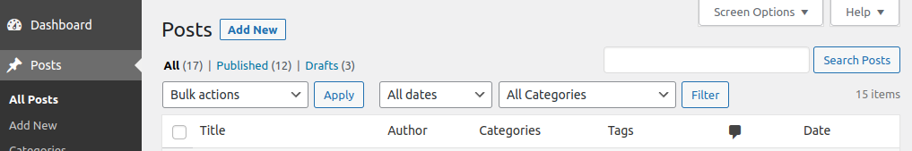
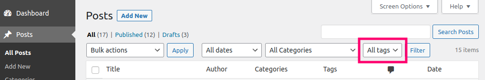

# Admin Posts List Tag Filter #
**Contributors:** [gregross](https://profiles.wordpress.org/gregross/)
**Plugin URI:** http://toolstack.com/admin-posts-list-tag-filter
**Author URI:** http://toolstack.com
**Tags:** admin posts tags
**Requires at least:** 3.5
**Tested up to:** 6.1
**Requires PHP:** 7.0
**Stable tag:** 1.0
**License:** GPLv2

Admin Posts List Tag Filter - Adds a tags filter select box to the posts list (any any other post type that has tag support) in the admin screen.

## Description ##

Ever wonder why you can filter your posts in the admin screen by date and category but not tags?

Well I don't know why it's not include by default, but you can now add it with this simple plugin.  Just install and active and a drop down will appear beside the categories filter and you can filter by tag to your hearts content!

This code is released under the GPL v2, see license.txt for details.

## Installation ##

1. Extract the archive file into your plugins directory in the admin-posts-list-tag-filter folder.
2. Activate the plugin in the Plugin options.
3. Done!

## Frequently Asked Questions ##

### Are there any options for this plugin ###

No, everything is taken care of automatically.  If you have custom post types that don't support tags, or have enabled tags on post types that by default don't support them (like pages), the plugin automatically detects this and acts accordingly.

## Screenshots ##

### 1. Post list without tag filter. ###

### 2. Post list with tag filter. ###

## Changelog ##

### 1.0 ###

* Release date: TBD
* Initial release.

## Upgrade Notice ##

None at this time.

## Roadmap ##

* None at this time!
